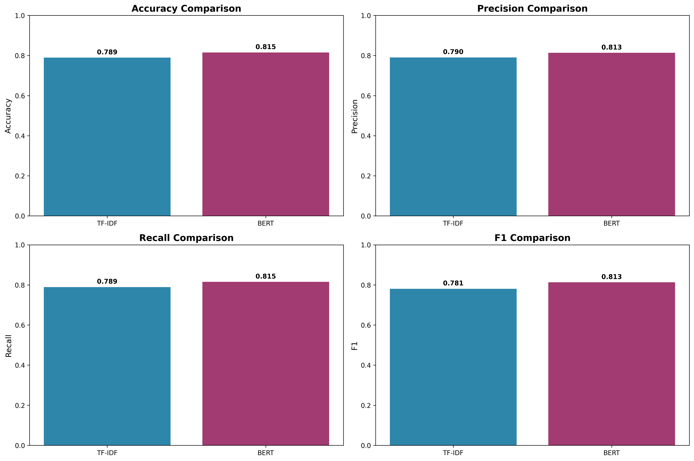
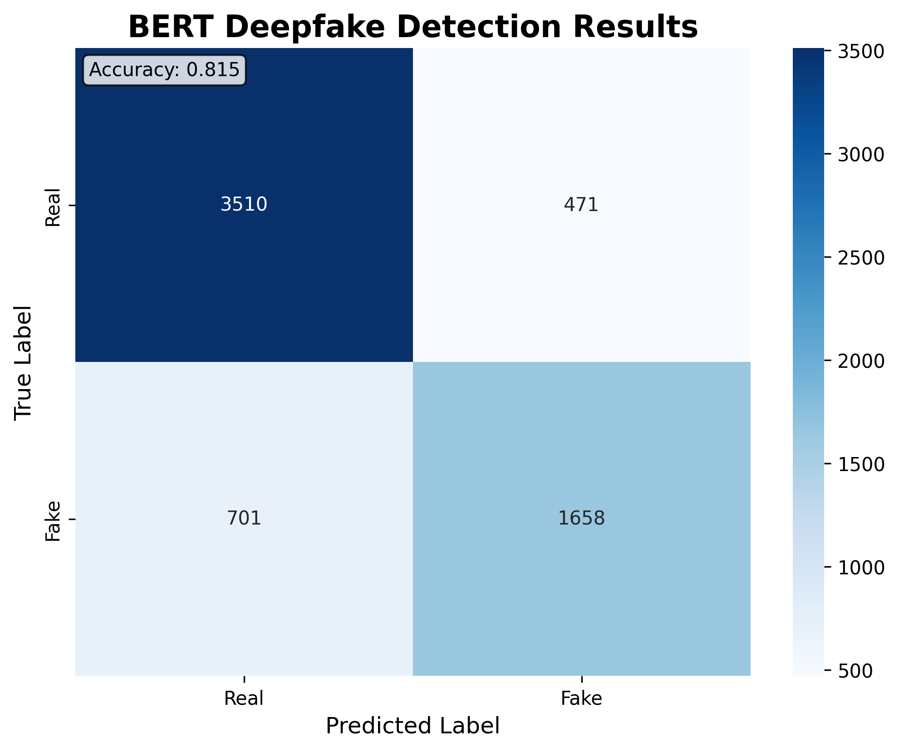

# SpeakNoLie: Audio Deepfake Detection via Text Analysis

Detecting AI-generated speech by analyzing *what was said*, not how it sounded. We convert audio to text with Whisper, then use NLP models to distinguish real human speech from deepfake-generated content.

**Team:** Xavier Briggs, Jasmine Kamara, Aadhitya Raam Ashok, Sabrina Naseri (AI4ALL Group 11E)

---

## Results

| Model | Accuracy | Precision | Recall | F1 Score |
|-------|----------|-----------|--------|----------|
| **BERT** | **81.51%** | **81.32%** | **81.51%** | **81.30%** |
| TF-IDF | 78.93% | 79.05% | 78.93% | 78.05% |

### Model Comparison



### BERT Confusion Matrix



See [project_report.md](project_report.md) for detailed analysis and findings.

---

## How It Works

```
Audio (.wav) ──> Whisper STT ──> Text Transcript ──> Feature Extraction ──> Neural Network ──> Real / Fake
                                                      ├─ TF-IDF features
                                                      └─ BERT embeddings
```

Instead of analyzing audio signals directly, we transcribe speech to text and look for linguistic patterns that distinguish real speech from AI-generated speech. This text-based approach offers an alternative angle to traditional audio-based detection methods.

---

## Dataset

We use the [In-the-Wild](https://deepfake-demo.aisec.fraunhofer.de/in_the_wild) dataset:

- **31,699 samples** (20,056 real / 11,643 fake)
- 63% real / 37% fake split
- Real-world deepfake examples collected from the internet

---

## Project Structure

```
├── data/
│   └── processed/          # Processed CSV transcript files
├── notebooks/              # Jupyter notebook for exploring results
├── src/
│   ├── data/               # Data processing and wav-to-CSV conversion
│   ├── features/           # TF-IDF and BERT feature extraction
│   ├── models/             # Neural network training and evaluation
│   └── visualization/      # Plot generation scripts
├── visualizations/         # Generated plots and metric CSVs
├── project_report.md       # Detailed project report
├── requirements.txt        # Python dependencies
└── README.md
```

---

## Quickstart

1. **Clone the repository**
   ```bash
   git clone https://github.com/xavierbriggs/speaknolie.git
   cd speaknolie
   ```

2. **Create a virtual environment**
   ```bash
   python -m venv venv
   source venv/bin/activate  # On Windows: venv\Scripts\activate
   ```

3. **Install dependencies**
   ```bash
   pip install -r requirements.txt
   ```

4. **Run feature extraction** (requires transcript CSVs in `data/processed/`)
   ```bash
   python src/features/tfidf_features.py
   python src/features/bert_features.py
   ```

5. **Train and evaluate models**
   ```bash
   python src/models/train_nn.py
   ```

---

## Citations

- Müller, N. M., Czempin, P., Dieckmann, F., Frober, A., & Böttinger, K. (2022). *Does Audio Deepfake Detection Generalize?* Proceedings of Interspeech 2022.
- Radford, A., Kim, J. W., Xu, T., Brockman, G., McLeavey, C., & Sutskever, I. (2022). *Robust Speech Recognition via Large-Scale Weak Supervision.* OpenAI.
- Devlin, J., Chang, M., Lee, K., & Toutanova, K. (2019). *BERT: Pre-training of Deep Bidirectional Transformers for Language Understanding.* NAACL-HLT.

## License

This project is licensed under the MIT License. See [LICENSE](LICENSE) for details.
